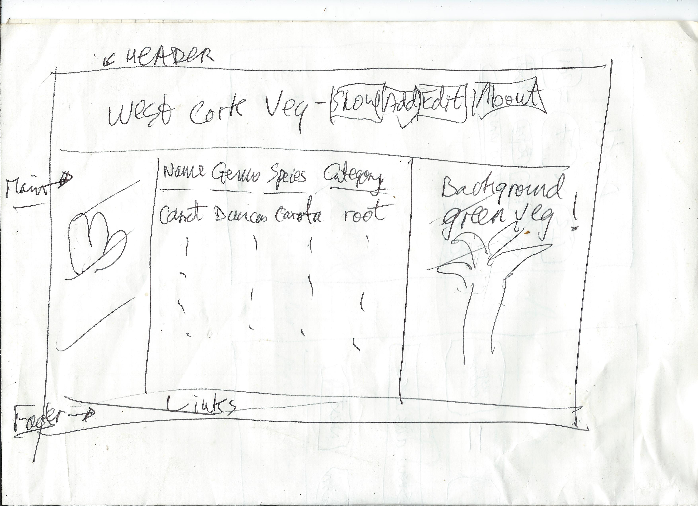
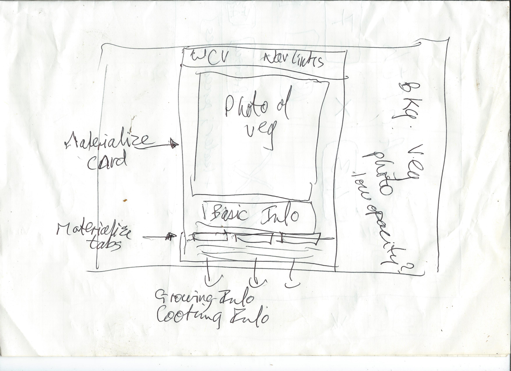

# West Cork Vegetables

This web application has been designed and built by me, John Lynch, to satisfy the requirements for the "Data Centric Development" project of the Code Institute Full-Stack Software Development course I am currently pursuing.   It is intended to be a community resource for vegetable gardeners in West Cork, Ireland, where I live, and I hope to continue to develop it going forward.

There are many great organic vegetable growers in West Cork, some who operate on a commercial basis selling in farmers' markets or to independent shops or to restaurants or supermarkets; some who grow primarily for their own use and for their families' but sell of excess to the local wholefood shop for example; and others who grow purely for their own households and for the wonderful satisfaction in growing their own food, the feeling of vibrant life energy that comes from crunching into a freshly-dug carrot, the exuberant mouth-feel of a ripe cherry tomato lightly plucked from its cane.

## Specification / Design

I would like to begin collating information to build a database of vegetables that can be grown in West Cork, which can be augmented by contributions from any West Cork vegetable gardeners; or even non-West Cork gardeners!

For each vegetable grown, the database will store its common names, its Linnaean name, its category (leafy, root, bulb etc.), information, comments, growing tips, cooking tips and photographs.   Once sufficient content has been gathered, it will also show its ideal soil type (clay, sandy, loamy etc.) and moisture content (wet, dry, medium), time to sow indoors, time to plant out, time to sow outdoors, lists of suppliers.   I shall be open to feature requests from users!

Logging in will bring the user to a list of all vegetables in the database, with buttons to show, edit or delete them and links that can be clicked to sort or filter the list:  users will be able to click to sort the list by category, genus, common name or creator, and display lists of vegetables filtered by different properties, e.g. "All fruiting vegetables" or "All Alliums".

Clicking "Show" for a vegetable will cause a detailed view to be displayed. with a photograph.   Registered users will be able to upload photographs for a new entry, to add to an existing entry or replace an existing image.

### The project specification states:

> Optionally, you may choose to add basic user registration and authentication to the site. This can as simple as adding a 
> username field to the recipe creation form, without a password (for this project only, this is not expected to be secure)

In accordance with this, the user will be allowed to register just by logging in with a username.   The list of users will just be stored in memory so will not persist over a server reboot.   Registered users will be automatically approved as editors and as such will have full CRUD permissions.   Unregistered users will not be able to update or delete records.

I like to trust people but accept that if this becomes a real web app rather than, as it is now, a project for a course, I'll have to introduce a proper user registration and authorisation scheme.

The vegetables will be stored as documents in a non-relational MongoDB database hosted with mLab.   The app will be hosted with Heroku.

## UX
 
### User stories

- Taidhgh, new to vegetable gardening, has some time off work in April so wants to browse, look at the pictures, read the wisdom of others and get an idea what he can plant straightaway and get a quick crop from.

The app should make it easy and intuitive to be able to see a list of all vegetables in the database together with a detailed view of any individual vegetable, with useful information and good photographs.

- Siobhan, just finished an intensive horticulture course, has just moved to West Cork with the intention of starting a business growing vegetables for restaurants.   She wants to see what other people are growing, generally get a feel of the West Cork organic growing scene, and in particular find out who's supplying good-quality seed garlic.

She should enjoy browsing and reading the comments, and if she clicks "Show" against the garlic entry she ought to be able to see lots of useful information about growing garlic in West Cork, and hopefully a list of all suppliers too.

- Dave, an experienced West Cork organic vegetable grower, just wants to share his knowledge by editing and adding to the entries to augment the database with handy tips and ideas for less experienced gardeners.

It should be a painless exercise to edit or add to the existing content.

### UI

I conceived the design in my head and made a couple of sketches on paper (scans below), then let the design evolve as I developed the app and introduced features step by step.

I tried to give the site a natural feel with browns and greens and a background of green leafy vegetables.

## Features

## Technologies Used

I developed the app on my local machine, coding in Sublime Text 3 using Emmet, and running a standard Bash terminal in Ubuntu 18.   My default browser is Chrome 70/71 but from time to time I also check how the app appears in Firefox Developer Edition, and on tablet browsers.

The app is coded in Python 3, using Flask and a MongoDB instance hosted at mLab.   It is deployed to Heroku.

It uses Jinja templates for the views and PyMongo for database access.   The vegetables are stored as one collection in the database, one document per vegetable.   The categories are stored as another collection.   References to users are stored in an array in memory.   Uploaded images are saved to the `images` directory and named `&lt;vegetable name&gt;.jpg` or `&lt;vegetable name&gt`;.png, so we can find them without having to index them.   Going forward, ancilliary images will be allowed, and this will be handled by the addition of a numerical suffix preceding the file extension.

The views are styled with Materialize.   Having developed the first three projects with raw CSS in order to learn it better, I decided to try using a CSS framework, and after watching a few tutorials I found that Materialize seemed easier and more intuitive to me than Bootstrap.   I played with it a little then incorporated it to make it the foundation of the site's styling.   Materialize uses a little jQuery, other than that I use no Javascript.   All the logic is implemented in Python.

In quest of learning all the plumbing and wiring necessary for such an app, I have made much use of a number of websites, particularly

- [Stack Overflow][0]
- [tutorialspoint][1]
- [Materialize][2]
- [The Hitchhiker’s Guide to Python][3]
- [Explore Flask][4]
- [Flask / Pocoo][5]
- [Miguel Grinberg's blog][6]
- [Python Tips][7]

## Testing

The app has been manually tested extensively throughout the development process, and when bugs have been found I have either fixed them or noted them down for later fixing.

Each time I introduce a new feature, change something or fix a bug, I have attempted to break the app if possible.

As this has been only my second proper Flask app (and first with database), a number of issues were significant during the development process, and required me to use the above websites to help me find the correct syntax.   Examples:  getting file paths right in constructing URIs, e.g. for saving the images; keeping track of users; interrogating and updating the database; constraining and validating form input.

Extensive testing was required, and accessing pages from different starting points, registered and unregistered, was important.

I tested mobile responsiveness in Chrome Dev Tools and on my Android tablet and Android phone.

## Deployment

The app is deployed to Heroku and can be accessed at [West Cork Veg][8].

Version control is implememnted in git, and I have pushed the project directory to Github at [West Cork Veg Github repo][9], as well as pushing to Heroku.   I have largely used 'micro-commits' with detailed commit messages, as (apart from its being considered good practice) it means I can look back at the log when implementing future similar projects in order to learn from my mistakes and hopefully obviate issues.  

The database is hosted at [mLab][10].

For production, the app's `debug` attribute is set to False, and the secret data, i.e the `app.secret_key` and the database connection string encoding the password in plain text, are stored as environment variables at Heroku and accessed through the `os.getenv()` method.

## Acknowledgements

Small bits of code have been copied from elsewhere, such as Materialize markup, and the Python function `allowed_file(filename)`.   The latter is acknowledged in a copmment above the function.

All vegetable images are either my own or I have been let use them by friends without restrictions or the necessity of attribution.

Thanks to all the open-source community and all the community-minded developers whose sharing of their knowledge and understanding has enabled me to comprehend the necessary concepts to be able to build this app.   And also to all those who have contributed to making a dev's life a bit easier by building frameworks such as Flask and Materialize.

[0]: https://stackoverflow.com/
[1]: https://www.tutorialspoint.com/flask
[2]: https://materializecss.com
[3]: https://docs.python-guide.org/
[4]: http://exploreflask.com/en/latest/
[5]: http://flask.pocoo.org/
[6]: https://blog.miguelgrinberg.com/category/Flask
[7]: http://book.pythontips.com/en/latest/
[8]: https://wcveg.herokuapp.com/
[9]: https://github.com/teraspora/wc-veg
[10]: https://mlab.com/